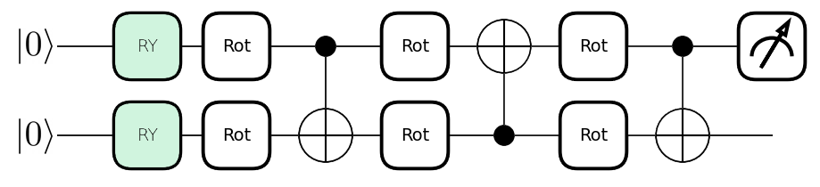
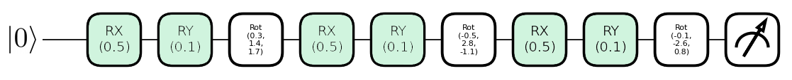
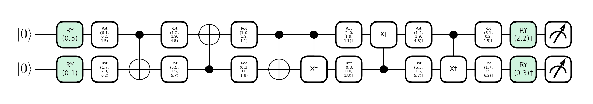

# Quantum Machine Learning Tutorials 
This repository contains tutorials on Quantum Machine Learning. The tutorials are written in Jupyter Notebooks and are intended to be run on Google Colab. 

**Table of Contents**
- [Quantum Machine Learning Tutorials](#quantum-machine-learning-tutorials)
  - [Folder Structure:](#folder-structure)
  - [Colab Links:](#colab-links)
- [Training Performance:](#training-performance)
  - [Explicit Model:](#explicit-model)
  - [Data Reuploading Model:](#data-reuploading-model)
  - [Implicit Model:](#implicit-model)

## Folder Structure:
The folder structure for demos follows the following pattern:
* [`logs/`](logs/) : Contains the logs from [tensorboard](https://www.tensorflow.org/tensorboard).
*  [`Saved_vars/`](Saved_vars/) : Contains the saved data sets to train the models on
*  **Notebooks**:
*  *  [`DataGenerator.ipynb`](DataGenerator.ipynb) : This notebook creates a random quantum circuit from which we sample to create our dataset.
   *  [`ExplicitModel.ipynb`](ExplicitModel.ipynb) : This notebook contains the implementation of the explicit model for the XOR gate.
   *  [`ImplicitModel.ipynb`](ImplicitModel.ipynb) : This notebook contains the implementation of the implicit model for the XOR gate.
   *  [`Data_Reuploading.ipynb`](Data_Reuploading.ipynb) : This notebook contains the implementation of the Quantum Neural Network for the XOR gate.
* [`Media/`](Media/) : Contains the images from training. 

## Colab Links:
The notebooks can be run on Google Colab by clicking on the following links:

| **Notebook**                                       | **Colab**                                                                                                                                                                                                                                         |
| -------------------------------------------------- | ------------------------------------------------------------------------------------------------------------------------------------------------------------------------------------------------------------------------------------------------- |
| [`ExplicitModel.ipynb`](ExplicitModel.ipynb)       | <a target="_blank" style="display: inline" href="https://colab.research.google.com/github/vinayak19th/QML-Tutorials/blob/master/ExplicitModel.ipynb">    |
| [`ImplicitModel.ipynb`](ImplicitModel.ipynb)       | <a target="_blank" style="display: inline" href="https://colab.research.google.com/github/vinayak19th/QML-Tutorials/blob/master/ImplicitModel.ipynb">    |
| [`Data_Reuploading.ipynb`](Data_Reuploading.ipynb) | <a target="_blank" style="display: inline" href="https://colab.research.google.com/github/vinayak19th/QML-Tutorials/blob/master/Data_Reuploading.ipynb"> |
| [`DataGenerator.ipynb`](DataGenerator.ipynb)       | <a target="_blank" style="display: inline" href="https://colab.research.google.com/github/vinayak19th/QML-Tutorials/blob/master/DataGenerator.ipynb">    |

# Training Performance:

## Explicit Model:

<table>
<tr>
  <th>Performance Over Time</th>
  <th>Observations</th>
</tr>
<tr>
  <td>  </td>
  <td>  
    The data starts matching the target distribution within 6 epochs
    </td>
  </tr>
</table>

## Data Reuploading Model:

<table>
<tr>
  <th>Performance Over Time</th>
  <th>Observations</th>
</tr>
<tr>
  <td>  </td>
  <td>  
    The data starts matching the target distribution within 6 epochs
    </td>
  </tr>
</table>

## Implicit Model:

<table>
<tr>
  <th>Performance Over Time</th>
  <th>Observations</th>
</tr>
<tr>
  <td>  </td>
  <td>  
    The model is very sampling sensitive and the training can take random steps
    </td>
  </tr>
</table>

